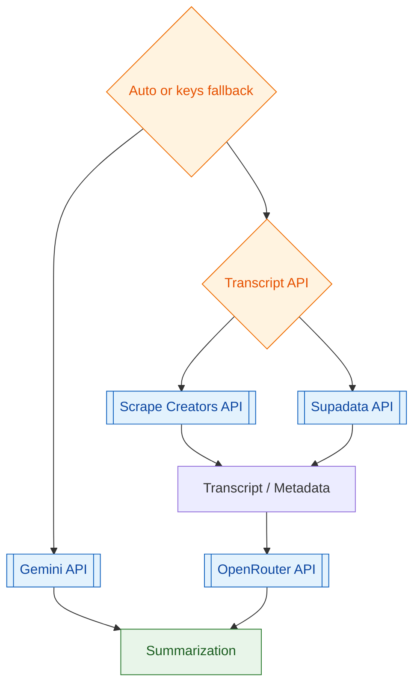

# YouTube Summarizer Backend API


**Frontend:** [YouTube Summarizer UI](https://github.com/teron131/youtube-summarizer-ui)

A Python backend API for YouTube video analysis. It focuses on transcript-first processing with provider-based extraction and provider-routed summarization.

> **Status:** Active refactor toward a cleaner provider-mode pipeline.

## 🌟 Key Features

- **🎯 Unified API Layer**: Backend endpoints for scraping, summarizing, and streaming progress updates.
- **🧾 Provider-Based Transcript Flow**: Uses Scrape Creators / Supadata for transcript and metadata retrieval.
- **✂️ Simplified Transcript Shape**: Normalized transcript text only (no timestamp-level transcript in API output).
- **🤖 Single Summarization Path**: One production-focused summarization flow with configurable LLM provider.
- **🔌 Flexible LLM Routing**: Supports Gemini/OpenRouter model backends via environment configuration.
- **⚡ API-First Design**: FastAPI endpoints designed for UI integration and streaming UX.

## 🗺️ Planned Workflow (Better-Youtube Style)

The following workflow reflects the target architecture plan for this repo.



## 📌 Plan Notes

- The backend remains transcript-first: transcript APIs feed the single summarization path.
- Transcript payloads are normalized to text segments/blocks; timestamp-level transcript detail is out of scope.
- Runtime behavior is now simplified to provider selection (Gemini/OpenRouter) instead of summary mode selection.
- Router behavior is explicit: it resolves `auto` first, then falls back to whichever provider key is available.

## 🚀 Setup & Development

### Prerequisites

- Python 3.12+
- API Keys: `SCRAPECREATORS_API_KEY` and/or `SUPADATA_API_KEY`, `GEMINI_API_KEY`, `OPENROUTER_API_KEY` (optional)

### 1. Installation

```bash
# Recommended: Use UV
uv sync
uv pip install -e .

# Alternative: Use pip
pip install -r requirements.txt
```

### 2. Configuration

Create a `.env` file (see `.env_example`):

```env
SCRAPECREATORS_API_KEY=...
SUPADATA_API_KEY=... # Optional transcript provider
TRANSCRIPT_PROVIDER_PREFERENCE=scrapecreators # scrapecreators | supadata
GEMINI_API_KEY=...
OPENROUTER_API_KEY=... # Optional
PORT=8080
```

### 3. Execution

```bash
# Development
python app.py

# Production
./start.sh
```

## 🎯 API Reference

| Endpoint            | Method | Description                                                        |
| ------------------- | ------ | ------------------------------------------------------------------ |
| `/scrape`           | `POST` | Extract video metadata and normalized transcript text via provider |
| `/summarize`        | `POST` | Generate AI summary (provider-routed path)                         |
| `/stream-summarize` | `POST` | Real-time streaming updates of summarization progress              |
| `/health`           | `GET`  | System status and API configuration check                          |

_Interactive docs available at `/api/docs` or `/api/redoc`._
