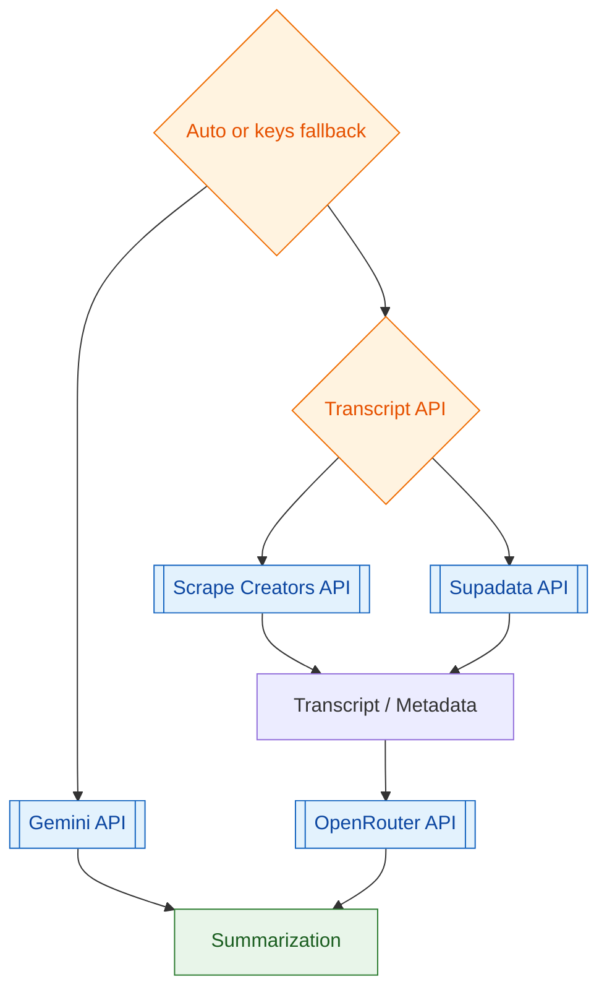

# YouTube Summarizer MCP Server


**Frontend:** [YouTube Summarizer UI](https://github.com/teron131/youtube-summarizer-ui)

A Python MCP server for YouTube video analysis. It focuses on transcript-first processing with provider-based extraction and provider-routed summarization.

> **Status:** Active refactor toward a cleaner provider-mode pipeline.

## 🌟 Key Features

- **🎯 Unified MCP Layer**: Tools for scraping, summarizing, and health checks.
- **🧾 Provider-Based Transcript Flow**: Uses Scrape Creators / Supadata for transcript and metadata retrieval.
- **✂️ Simplified Transcript Shape**: Normalized transcript text only (no timestamp-level transcript in API output).
- **🤖 Single Summarization Path**: One production-focused summarization flow with configurable LLM provider.
- **🔌 Flexible LLM Routing**: Supports Gemini/OpenRouter model backends via environment configuration.
- **⚡ MCP-First Design**: Designed for agent integrations (ChatGPT and other MCP clients).

## 🗺️ Planned Workflow (Better-Youtube Style)

The following workflow reflects the target architecture plan for this repo.



## 📌 Plan Notes

- The backend remains transcript-first: transcript APIs feed the single summarization path.
- Transcript payloads are normalized to text segments/blocks; timestamp-level transcript detail is out of scope.
- Runtime behavior is now simplified to provider fallback (Gemini/OpenRouter) instead of summary mode selection.
- Router behavior is internal: it auto-selects available provider keys using fallback order.
- `summarize` accepts YouTube `url` only; transcript text and language resolution remain internal processing steps.

## 🚀 Setup

### Prerequisites

- Python 3.12+
- API Keys: `SCRAPECREATORS_API_KEY` and/or `SUPADATA_API_KEY`, `GEMINI_API_KEY`, `OPENROUTER_API_KEY` (optional)

### 1. Installation

```bash
uv sync
uv pip install -e .
```

### 2. Configuration

Create a `.env` file (see `.env.example`):

```env
SCRAPECREATORS_API_KEY=...
SUPADATA_API_KEY=... # Optional transcript provider
GEMINI_API_KEY=...
OPENROUTER_API_KEY=... # Optional
GEMINI_SUMMARY_MODEL=gemini-3-flash-preview
OPENROUTER_SUMMARY_MODEL=x-ai/grok-4.1-fast
OPENROUTER_REASONING_EFFORT=medium
DEFAULT_TARGET_LANGUAGE=auto # auto | en | zh
PORT=8080
```

Model IDs are environment-controlled for both interfaces.  
Interface controls are intentionally split:

- MCP `summarize`: URL only (`summarize(url)`).
- FastAPI `/summarize` and `/stream-summarize`: accepts `provider` and `target_language`.

When `DEFAULT_TARGET_LANGUAGE=zh`, output is always Traditional Chinese (繁體中文).

### 3. Execution

```bash
# stdio transport
uv run python mcp_server.py

# HTTP transport (for remote MCP clients)
MCP_TRANSPORT=http MCP_HOST=0.0.0.0 MCP_PORT=8000 uv run python mcp_server.py
```

## 🧰 MCP Server (FastMCP)

This repo includes a standalone FastMCP server at `mcp_server.py` (no FastAPI route dependency) that exposes tools:

- `health`
- `scrape`
- `summarize`

Tool signatures:

- `health() -> dict`
- `scrape(url: str) -> dict`
- `summarize(url: str) -> dict`

MCP intentionally does not expose `provider`/`target_language` controls.
Those remain available on FastAPI endpoints for direct API clients.

When running in HTTP mode for ChatGPT/App integrations, OAuth is required.

Set these environment variables:

- `MCP_AUTH_MODE=google_oauth`
- `MCP_SERVER_BASE_URL=https://<your-cloud-run-url>`
- Optional scopes override:
  - `MCP_GOOGLE_REQUIRED_SCOPES="openid"` (recommended with GoogleProvider)

If using Google OAuth mode, also set:

- `MCP_GOOGLE_CLIENT_ID=<google-oauth-client-id>`
- `MCP_GOOGLE_CLIENT_SECRET=<google-oauth-client-secret>`

Run over stdio:

```bash
uv run python mcp_server.py
```

Or with FastMCP CLI:

```bash
uv run fastmcp run mcp_server.py
```

Run over HTTP transport:

```bash
MCP_TRANSPORT=http MCP_HOST=0.0.0.0 MCP_PORT=8000 MCP_AUTH_MODE=google_oauth MCP_SERVER_BASE_URL=https://your-service.run.app MCP_GOOGLE_CLIENT_ID=... MCP_GOOGLE_CLIENT_SECRET=... uv run python mcp_server.py
```

Cloud Run deployment target region: `asia-east1` (Taiwan).

### One-Step Future Setup (Key Checklist)

Use this once to bootstrap, then redeploys are one command.

Required secrets/keys:

- `MCP_GOOGLE_CLIENT_ID` (Google OAuth client ID)
- `MCP_GOOGLE_CLIENT_SECRET` (Google OAuth client secret)
- At least one LLM key:
  - `GEMINI_API_KEY` or `OPENROUTER_API_KEY`
- At least one transcript key:
  - `SCRAPECREATORS_API_KEY` or `SUPADATA_API_KEY`

Required non-secret env vars:

- `MCP_AUTH_MODE=google_oauth`
- `MCP_SERVER_BASE_URL=https://<your-cloud-run-url>`

Google OAuth client setup:

- Add this redirect URI in Google OAuth credentials:
  - `https://<your-cloud-run-url>/auth/callback`
- The `<your-cloud-run-url>` must match `MCP_SERVER_BASE_URL` exactly.

#### First deploy in a new region/service

Set values in local `.env` (or shell env), then run:

```bash
ENV_FILE=.env bash scripts/deploy_cloud_run.sh
```

The script will:

- create/update Secret Manager secrets
- deploy Cloud Run with non-sensitive config in env vars
- mount sensitive values via `--set-secrets`

#### Subsequent deploys

```bash
bash scripts/deploy_cloud_run.sh
```

The script auto-resolves missing local values from current Cloud Run config + Secret Manager.

`scripts/deploy_cloud_run.sh` is the single script for deploy + OAuth sync.

On each run it also:

- syncs `MCP_SERVER_BASE_URL` to the live Cloud Run URL
- keeps `MCP_GOOGLE_CLIENT_ID` in env vars
- keeps `MCP_GOOGLE_CLIENT_SECRET` in Secret Manager
- prints the exact redirect URI:
  - `https://<your-cloud-run-url>/auth/callback`

### ChatGPT Connector Setup

After deploy is healthy, add the MCP in ChatGPT with these values:

- MCP Server URL: `https://<your-cloud-run-url>`
- Authentication: `OAuth`

Do not paste backend provider keys into ChatGPT:

- `GEMINI_API_KEY`
- `OPENROUTER_API_KEY`
- `SCRAPECREATORS_API_KEY`
- `SUPADATA_API_KEY`
- `MCP_GOOGLE_CLIENT_SECRET`

Those stay server-side in Cloud Run/Secret Manager.

If OAuth fails with `redirect_uri_mismatch`:

- Confirm Google OAuth redirect URI includes:
  - `https://<your-cloud-run-url>/auth/callback`
- Confirm `MCP_SERVER_BASE_URL` exactly matches the same host used in ChatGPT.

If tools appear but calls fail or disappear:

- Remove and re-add the connector in ChatGPT.
- Start a new chat after reconnect.
- Keep Cloud Run `max-instances=1` unless OAuth state is moved to shared persistent storage.
