# YouTube Summarizer Backend API


A comprehensive Python backend API for YouTube video analysis with AI-powered transcription and summarization. Built with FastAPI and featuring a robust multi-tier processing architecture for maximum reliability.

## 🆕 Recent Updates

- **🍪 Cookie-Based User Preferences**: Frontend now persists user model and language selections across browser sessions
- **🔄 Unified Model Selection**: Single model selector applies to both analysis and quality assessment phases
- **🎯 Enhanced Progress Tracking**: Improved progress bar completion and real-time status updates
- **🛠️ Better Error Handling**: Enhanced error messages and graceful degradation

## 🌟 Key Features

- **🎯 Master API Endpoint**: Single `/api/generate` endpoint orchestrating all processing capabilities
- **🔄 Multi-Tier Processing**: Scrape Creators scraper → yt-dlp + Fal.ai → LangGraph AI workflow
- **🎤 Smart Transcription**: Prioritizes Scrape Creators transcript, falls back to yt-dlp + Fal.ai transcription
- **🤖 AI Summarization**: LangGraph-powered self-checking workflow with dual AI provider support
- **📊 Comprehensive APIs**: Granular endpoints for specific tasks plus master orchestrator
- **🛡️ Robust Error Handling**: Graceful degradation with detailed logging
- **⚡ High Performance**: FastAPI with async processing and optimized audio handling
- **🍪 User Preferences**: Cookie-based persistence for model selection and language preferences
- **🔄 Unified Model Selection**: Single model selector applies to both analysis and quality assessment phases

## 🏗️ Architecture & Workflow

### 📊 Overall System Architecture

```mermaid
graph TD
    A[YouTube URL] --> B[Validate URL]
    B --> C[Scrape Creators Scraper<br/>📋 Extract Video Data]
    C --> D[Get Transcript<br/>📝 Direct from YouTube]
    D --> E{Transcript Available?}
    E -->|Yes| F[LangGraph AI Workflow<br/>🔄 Self-Checking Analysis]
    E -->|No| G[Download Audio<br/>🎵 yt-dlp]
    G --> H[Transcribe Audio<br/>🎤 Fal.ai API]
    H --> F
    F --> I[Return Complete Results]
    
    style A fill:#424242,color:#fff
    style B fill:#424242,color:#fff
    style C fill:#1E88E5,color:#fff
    style D fill:#1E88E5,color:#fff
    style E fill:#424242,color:#fff
    style G fill:#F9A825,color:#000
    style H fill:#F9A825,color:#000
    style F fill:#2E7D32,color:#fff
    style I fill:#424242,color:#fff
```



### 🔄 LangGraph AI Workflow Detail

The heart of our system is a sophisticated LangGraph workflow that ensures high-quality analysis through iterative refinement:

```mermaid
graph TD
    START([Start]) --> ROUTER[langchain_or_gemini<br/>🎯 Route by Input Type]

    ROUTER -->|YouTube URL| GEMINI_ANALYSIS[gemini_analysis_node<br/>🤖 Gemini SDK Analysis]
    ROUTER -->|Text/Transcript| LANGCHAIN_ANALYSIS[langchain_analysis_node<br/>🤖 LangChain Analysis]

    GEMINI_ANALYSIS --> GEMINI_QUALITY[gemini_quality_node<br/>📊 Quality Assessment]
    LANGCHAIN_ANALYSIS --> LANGCHAIN_QUALITY[langchain_quality_node<br/>📊 Quality Assessment]

    GEMINI_QUALITY --> GEMINI_CONDITION{should_continue_gemini<br/>Quality ≥ 90% OR<br/>Iterations ≥ 2?}
    LANGCHAIN_QUALITY --> LANGCHAIN_CONDITION{should_continue_langchain<br/>Quality ≥ 90% OR<br/>Iterations ≥ 2?}

    GEMINI_CONDITION -->|Yes| END([Final Analysis])
    LANGCHAIN_CONDITION -->|Yes| END

    GEMINI_CONDITION -->|No| GEMINI_ANALYSIS
    LANGCHAIN_CONDITION -->|No| LANGCHAIN_ANALYSIS

    style START fill:#424242,color:#fff
    style ROUTER fill:#424242,color:#fff
    style GEMINI_ANALYSIS fill:#8E24AA,color:#fff
    style LANGCHAIN_ANALYSIS fill:#8E24AA,color:#fff
    style GEMINI_QUALITY fill:#D84315,color:#fff
    style LANGCHAIN_QUALITY fill:#D84315,color:#fff
    style GEMINI_CONDITION fill:#424242,color:#fff
    style LANGCHAIN_CONDITION fill:#424242,color:#fff
    style END fill:#424242,color:#fff
```



**🎨 Color Legend:**
- 🔵 **Blue**: Scrape Creators Scraper (metadata & transcript extraction)
- 🟠 **Amber**: Fallback processing (yt-dlp + Fal.ai transcription)
- 🟣 **Purple**: AI Analysis (Gemini/LangChain)
- 🟥 **Deep Orange**: Quality Assessment
- 🟢 **Dark Green**: LangGraph Final Processing
- 🔷 **Cyan**: Refinement steps (improve analysis)
- ⚫ **Dark Gray**: Decision points & flow control

### 🧠 LangGraph Workflow Features

- **🎯 Dual AI Provider Support**: Automatically routes between Gemini SDK (for YouTube URLs) and LangChain (for text)
- **🔄 Iterative Refinement**: Quality checking with optional improvement cycles
- **⚡ Streaming Support**: Real-time progress updates through workflow states

## 🚀 Quick Start

### Prerequisites

- Python 3.11+
- FFmpeg (for audio processing fallback)
- API Keys: `SCRAPECREATORS_API_KEY`, `GEMINI_API_KEY`, `FAL_KEY`, `OPENROUTER_API_KEY` (optional)

### 1. Installation

```bash
git clone <repository-url>
cd youtube-summarizer

# Install with UV (recommended)
uv sync

# Or with pip
pip install -r requirements.txt

# Install as editable package
uv pip install -e .
```

### 2. Environment Configuration

```bash
# Copy example environment file
cp .env_example .env

# Edit .env with your API keys
```

Required environment variables:
```env
SCRAPECREATORS_API_KEY=your_scrapecreators_api_key
GEMINI_API_KEY=your_gemini_api_key
FAL_KEY=your_fal_api_key
OPENROUTER_API_KEY=your_openrouter_api_key  # Optional
PORT=8080
HOST=0.0.0.0
```

### 3. Start the API Server

```bash
# Development mode
python app.py

# Or using uvicorn directly
python -m uvicorn app:app --host 0.0.0.0 --port 8080

# Production mode
./start.sh
```

### 4. Access the API

- **API Server**: http://localhost:8080
- **Interactive Documentation**: http://localhost:8080/api/docs
- **Alternative Docs**: http://localhost:8080/api/redoc
- **Health Check**: http://localhost:8080/api/health

## 🎯 Complete API Reference

### 🌟 Master Endpoint

#### POST `/scrap` - Video Scraping and Transcript Extraction
**Extract video metadata and transcript using Scrape Creators scraper**

**Request:**
```json
{
  "url": "https://www.youtube.com/watch?v=VIDEO_ID"
}
```

**Response:**
```json
{
  "status": "success",
  "message": "Video scraped successfully",
  "url": "https://www.youtube.com/watch?v=VIDEO_ID",
  "title": "Video Title",
  "author": "Channel Name",
  "transcript": "Transcript with chapter formatting...",
  "duration": "00:06:32",
  "thumbnail": "https://img.youtube.com/vi/VIDEO_ID/maxresdefault.jpg",
  "view_count": 13462116,
  "processing_time": "7.5s",
  "timestamp": "2025-01-01T12:00:00.000Z"
}
```

### 📋 Analysis Endpoints

#### POST `/summarize` - LangGraph Analysis
Generate AI summary from provided text content using LangGraph workflow with user-selected models.

**Request:**
```json
{
  "content": "Long text content to summarize...",
  "content_type": "transcript",
  "analysis_model": "google/gemini-2.5-pro",
  "quality_model": "google/gemini-2.5-flash",
  "target_language": "en"
}
```

**Response:**
```json
{
  "status": "success",
  "message": "Analysis completed successfully",
  "analysis": {
    "title": "Extracted Title",
    "summary": "Comprehensive summary...",
    "takeaways": ["Key insight 1", "Key insight 2"],
    "key_facts": ["Important fact 1", "Important fact 2"],
    "chapters": [
      {
        "header": "Chapter Title",
        "summary": "Chapter content...",
        "key_points": ["Point 1", "Point 2"]
      }
    ],
    "keywords": ["keyword1", "keyword2", "keyword3"]
  },
  "quality": null,
  "processing_time": "15.2s",
  "iteration_count": 1,
  "timestamp": "2025-01-01T12:00:00.000Z"
}
```

#### POST `/stream-summarize` - Streaming Analysis
Real-time streaming updates of the LangGraph workflow progress with user-selected models.

**Request:**
```json
{
  "content": "Long text content to summarize...",
  "content_type": "transcript",
  "analysis_model": "google/gemini-2.5-pro",
  "quality_model": "google/gemini-2.5-flash",
  "target_language": "en"
}
```

**Response Stream (Server-Sent Events):**
```json
// Initial status
data: {"type": "status", "message": "Starting analysis...", "timestamp": "2025-01-01T12:00:00.000Z"}

// Workflow progress updates
data: {"transcript_or_url": "content...", "analysis": null, "quality": null, "iteration_count": 0, "is_complete": false, "timestamp": "2025-01-01T12:00:01.000Z", "chunk_number": 0}

data: {"transcript_or_url": "content...", "analysis": {...}, "quality": {"percentage_score": 85}, "iteration_count": 1, "is_complete": false, "timestamp": "2025-01-01T12:00:15.000Z", "chunk_number": 1}

// Final completion
data: {"type": "complete", "message": "Analysis completed", "processing_time": "25.3s", "total_chunks": 3, "timestamp": "2025-01-01T12:00:25.000Z"}
```

#### GET `/health` - Health Check
System status and API availability with environment configuration.

**Response:**
```json
{
  "status": "healthy",
  "message": "YouTube Summarizer API is running",
  "timestamp": "2025-01-01T12:00:00.000Z",
  "version": "3.1.0",
  "environment": {
    "gemini_configured": true,
    "scrapecreators_configured": true
  }
}
```

## 🔄 Processing Architecture

### Tier 1: Scrape Creators YouTube Scraper
- **Primary Method**: Direct transcript and metadata extraction via Scrape Creators API
- **Data Extracted**: Title, author, duration, view count, thumbnail, transcript with timestamps
- **Chapter Support**: Automatic chapter detection and transcript organization
- **Fallback**: yt-dlp audio download + Fal.ai transcription when transcript unavailable

### Tier 2: LangGraph AI Analysis
- **Method**: Dual-provider AI processing with quality assessment
- **Gemini Path**: Direct YouTube URL processing for maximum context
- **LangChain Path**: Text-based analysis with OpenRouter model access
- **Quality Control**: Automated quality checking with iterative refinement

### Tier 3: Graceful Degradation
- **Method**: Partial processing with available components
- **Error Handling**: Detailed logging and user-friendly error messages

## 🔄 LangGraph AI Workflow Architecture

### 🎯 Core Components

The LangGraph workflow implements a sophisticated self-checking analysis system with the following components:

#### 📊 Quality Assessment Framework
- Evaluates analysis completeness, structure, grammar, timestamps, content filtering, and language consistency

#### 🔀 Dual Processing Paths

**🤖 Gemini Path (YouTube URLs)**
- Direct URL processing using Gemini SDK
- File URI integration for efficient video analysis
- Thinking capabilities with configurable budget
- Native structured output with Pydantic schemas

**🔗 LangChain Path (Text/Transcripts)**
- OpenRouter API integration for flexible model access
- Prompt templates for consistent analysis structure
- Structured output parsing with validation
- Support for multiple LLM providers

#### ⚙️ Workflow Configuration

```python
# User-selectable workflow settings (via API parameters)
analysis_model = "google/gemini-2.5-pro"  # User-selected analysis model
quality_model = "google/gemini-2.5-flash"  # User-selected quality model
target_language = "auto"                   # User-selected language

# Global workflow settings
MIN_QUALITY_SCORE = 90  # 90% quality threshold
MAX_ITERATIONS = 2      # Maximum refinement cycles
```

#### 🔄 Processing States

```python
class WorkflowState(BaseModel):
    # Input
    transcript_or_url: str
    
    # Analysis results
    analysis: Optional[Analysis] = None
    quality: Optional[Quality] = None
    
    # Control fields
    iteration_count: int = Field(default=0)
    is_complete: bool = Field(default=False)
```

### 🚀 Workflow Execution

#### Standard Processing
```python
from youtube_summarizer.summarizer import summarize_video

# Single execution with final result
analysis = summarize_video("https://www.youtube.com/watch?v=VIDEO_ID")
print(f"Quality Score: {analysis.quality_score}%")
```

#### Streaming Processing
```python
from youtube_summarizer.summarizer import stream_summarize_video

# Real-time progress updates
for state in stream_summarize_video("transcript text"):
    print(f"Iteration {state.iteration_count}: {state.quality.percentage_score if state.quality else 'Processing'}%")
```

### 🔧 Technical Implementation Details

#### Node Functions
- **`langchain_or_gemini()`**: Routes input based on type (URL vs text)
- **`*_analysis_node()`**: Initial AI analysis generation
- **`*_quality_node()`**: Quality assessment and scoring
- **`*_refinement_node()`**: Iterative improvement based on feedback
- **`should_continue_*()`**: Conditional routing for workflow control

#### Graph Structure
```python
# Conditional routing from START
builder.add_conditional_edges(
    START,
    langchain_or_gemini,
    {
        "langchain_analysis": "langchain_analysis",
        "gemini_analysis": "gemini_analysis",
    },
)

# Quality-based refinement loops
builder.add_conditional_edges(
    "gemini_quality",
    should_continue_gemini,
    {
        "gemini_refinement": "gemini_refinement",
        END: END,
    },
)
```

### 📈 Processing Configuration

- **Quality Threshold**: 90% minimum score for acceptance
- **Max Iterations**: 2 refinement cycles maximum
- **Processing Time**: 15-45 seconds depending on content complexity

## 🛠️ Development

### Package Usage

```python
from youtube_summarizer.scrapper import scrap_youtube
from youtube_summarizer.summarizer import summarize_video, stream_summarize_video
from youtube_summarizer.utils import is_youtube_url, clean_youtube_url

# Video scraping with Scrape Creators
result = scrap_youtube("https://www.youtube.com/watch?v=VIDEO_ID")
print(result.title, result.author, len(result.transcript))

# AI summarization (LangGraph workflow) with custom models
analysis = summarize_video(
    "transcript content or YouTube URL",
    analysis_model="anthropic/claude-sonnet-4",
    quality_model="openai/gpt-5"
)

# Streaming analysis with progress updates and custom models
for state in stream_summarize_video(
    "transcript content",
    analysis_model="google/gemini-2.5-pro",
    quality_model="google/gemini-2.5-flash"
):
    print(f"Iteration {state.iteration_count}, Complete: {state.is_complete}")

# URL utilities
is_valid = is_youtube_url(url)
clean_url = clean_youtube_url(url)
```

### Running Tests

```bash
# Install development dependencies
uv add --dev pytest black ruff

# Run tests
pytest

# Format code
black .

# Lint code
ruff check .
```

## 🔧 Configuration

### User Preferences & Cookie Storage

The API supports cookie-based user preferences for a personalized experience:

#### 🍪 Cookie-Based Preferences
- **Cookie Name**: `youtube-summarizer-prefs`
- **Expiry**: 365 days (1 year)
- **Security**: `SameSite=Lax` for better security
- **Stored Data**:
  ```json
  {
    "analysisModel": "google/gemini-2.5-pro",
    "qualityModel": "google/gemini-2.5-flash",
    "targetLanguage": "auto"
  }
  ```

#### 🎯 Model Selection Behavior
- **Unified Selection**: Single model selector applies to both analysis and quality phases
- **Analysis Phase**: Uses selected model for initial content analysis
- **Quality Phase**: Uses same selected model for quality assessment and refinement
- **Persistence**: Preferences survive browser sessions and page refreshes

### Environment Variables

| Variable | Required | Description | Default |
|----------|----------|-------------|---------|
| `SCRAPECREATORS_API_KEY` | ✅ | Scrape Creators API key for YouTube scraping | - |
| `GEMINI_API_KEY` | ✅ | Google Gemini API key for AI analysis | - |
| `FAL_KEY` | ✅ | Fal.ai API key for audio transcription fallback | - |
| `OPENROUTER_API_KEY` | ❌ | OpenRouter API key for LangChain models | - |
| `PORT` | ❌ | Server port | 8080 |
| `HOST` | ❌ | Server host | 0.0.0.0 |

### Core Dependencies

- **FastAPI**: Web framework with automatic API documentation
- **requests**: HTTP client for Scrape Creators API integration
- **yt-dlp**: Video downloader for audio extraction fallback
- **google-genai**: Google Gemini AI client for direct URL processing
- **langchain**: LLM framework for flexible AI provider integration
- **langgraph**: Workflow orchestration for analysis pipeline
- **fal-client**: Audio transcription service
- **pydantic**: Data validation and settings management
- **uvicorn**: ASGI server

## 📊 Performance & Processing

### Processing Times
- **Scrape Creators Scraping**: 5-15 seconds (metadata + transcript extraction)
- **Audio Transcription**: 30-60 seconds (yt-dlp + Fal.ai fallback)
- **LangGraph AI Analysis**: 15-45 seconds (with quality checking)
- **Complete Processing**: 20-90 seconds total depending on method

### Error Handling
- Comprehensive logging for debugging
- Step-by-step processing status tracking
- Graceful degradation when components fail

## 🔍 Troubleshooting

### Common Issues

**FFmpeg not found:**
```bash
# macOS
brew install ffmpeg

# Ubuntu/Debian  
sudo apt update && sudo apt install ffmpeg

# Windows - Download from https://ffmpeg.org/
```

**API Key Configuration:**
```bash
# Check your .env file
cat .env

# Ensure keys are set
echo $SCRAPECREATORS_API_KEY
echo $GEMINI_API_KEY
echo $FAL_KEY
echo $OPENROUTER_API_KEY
```

**Import Errors:**
```bash
# Install in editable mode
uv pip install -e .

# Verify installation
python -c "import youtube_summarizer; print('OK')"
```

**Processing Failures:**
- Check logs in API response for detailed error information
- Verify video is publicly accessible and not age-restricted
- Ensure API keys have sufficient credits
- Test with `/health` endpoint to verify API configuration
