# YouTube Summarizer Backend API


**Frontend:** [YouTube Summarizer UI](https://github.com/teron131/youtube-summarizer-ui)

A comprehensive Python backend API for YouTube video analysis. It solves the difficulty of accessing YouTube content and generating customized, detailed summaries using a robust multi-tier processing architecture.

> **Note:** This problem is now deprecating.

## 🌟 Key Features

- **🎯 Master Orchestrator**: Single `/api/generate` endpoint managing the entire pipeline.
- **🔄 Multi-Tier Processing**: Primary scraper (Scrape Creators) → Fallback (yt-dlp + Fal.ai) → LangGraph AI.
- **🎤 Smart Transcription**: Prioritizes direct transcript extraction, falls back to Whisper transcription.
- **🤖 AI Summarization**: LangGraph-powered self-checking workflow with Gemini/OpenRouter support.
- **🛡️ Robust Operations**: Cookie-based preferences, graceful degradation, and detailed logging.
- **⚡ Performance**: Built with FastAPI, optimized for high-throughput async processing.

## 📊 Transcript Extraction Comparison

To ensure maximum reliability, the system evaluates multiple transcription methods based on robustness and speed.

| Method | Type | Robustness | Speed | Notes |
|--------|------|------------|-------|-------|
| **Premium API (Scrape Creators)** | **Direct** | ⭐⭐⭐⭐⭐ | ⚡ Fast | **Primary**. Extracts official/auto-captions directly. |
| **yt-dlp + Fal.ai / Local Whisper** | **Fallback** | ⭐⭐⭐ | 🐢 Slower | **Reliable Fallback**. Audio-based; prone to IP blocks/bot detection. |
| **Gemini Native Access** | **Direct** | ⭐⭐ | ⚡ Fast | **Not Used**. Unreliable transcript retrieval during development. |

> **Note on Fallback Methods:** While the `yt-dlp` and `Whisper` path provides a "fully local" capability, it is harder to host (requires **FFmpeg** and **GPU compute**) and is highly susceptible to **YouTube IP rate limits and bot detection**. Premium APIs are recommended for production-grade scraping.

## 🏗️ Technical Architecture

### 📊 Overall System Workflow
The system uses a 3-tier architecture to ensure analysis quality and system resilience.

```mermaid
graph TD
    A[YouTube URL] --> B[Validate URL]
    B --> C[Scrape Creators Scraper<br/>📋 Extract Video Data]
    C --> D[Get Transcript<br/>📝 Direct from YouTube]
    D --> E{Transcript Available?}
    E -->|Yes| F[LangGraph AI Workflow<br/>🔄 Self-Checking Analysis]
    E -->|No| G[Download Audio<br/>🎵 yt-dlp]
    G --> H[Transcribe Audio<br/>🎤 Fal.ai API]
    H --> F
    F --> I[Return Complete Results]
    
    style C fill:#1E88E5,color:#fff
    style G fill:#F9A825,color:#000
    style H fill:#F9A825,color:#000
    style F fill:#2E7D32,color:#fff
```



### 🔄 LangGraph AI Workflow Detail
The heart of our system is an iterative refinement loop that ensures analysis meets a 90% quality threshold.

```mermaid
graph TD
    START([Start]) --> ROUTER[langchain_or_gemini<br/>🎯 Route by Input Type]
    ROUTER -->|URL| GEMINI[Gemini SDK Analysis]
    ROUTER -->|Text| LANGCHAIN[LangChain Analysis]
    GEMINI --> G_QUAL[Quality Assessment]
    LANGCHAIN --> L_QUAL[Quality Assessment]
    G_QUAL --> G_COND{Score ≥ 90%?}
    L_QUAL --> L_COND{Score ≥ 90%?}
    G_COND -->|Yes| END([Final Result])
    L_COND -->|Yes| END
    G_COND -->|No| GEMINI
    L_COND -->|No| LANGCHAIN
    
    style GEMINI fill:#8E24AA,color:#fff
    style LANGCHAIN fill:#8E24AA,color:#fff
    style G_QUAL fill:#D84315,color:#fff
    style L_QUAL fill:#D84315,color:#fff
```



## 🚀 Setup & Development

### Prerequisites
- Python 3.11+
- FFmpeg (required for audio fallback)
- API Keys: `SCRAPECREATORS_API_KEY`, `GEMINI_API_KEY`, `FAL_KEY`, `OPENROUTER_API_KEY` (optional)

### 1. Installation
```bash
# Recommended: Use UV
uv sync
uv pip install -e .

# Alternative: Use pip
pip install -r requirements.txt
```

### 2. Configuration
Create a `.env` file (see `.env_example`):
```env
SCRAPECREATORS_API_KEY=...
GEMINI_API_KEY=...
FAL_KEY=...
OPENROUTER_API_KEY=... # Optional
PORT=8080
```

### 3. Execution
```bash
# Development
python app.py

# Production
./start.sh
```

## 🎯 API Reference

| Endpoint | Method | Description |
|----------|--------|-------------|
| `/scrape` | `POST` | Extract video metadata and transcript using Scrape Creators. |
| `/summarize` | `POST` | Generate AI summary using LangGraph (blocking). |
| `/stream-summarize`| `POST` | Real-time streaming updates of the AI workflow (SSE). |
| `/health` | `GET` | System status and API configuration check. |

*Interactive docs available at `/api/docs` or `/api/redoc`.*
